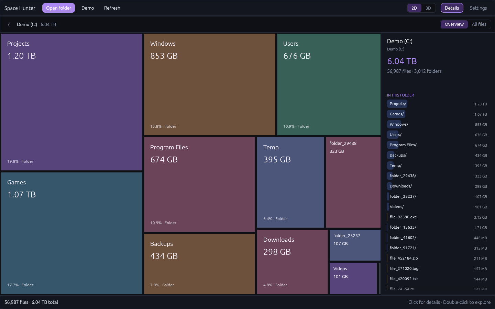
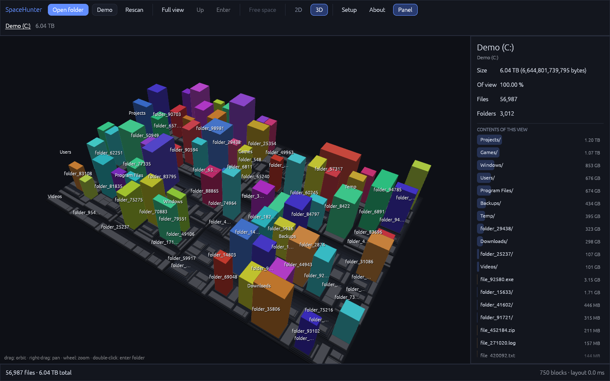

<div align="center">


# Space Hunter

**See where your disk space went.**
A fast disk-usage map in 2D and 3D, for Windows, Linux and the browser.

[**Download for Windows**](https://github.com/quisen/SpaceHunter/releases/latest/download/SpaceHunter.exe) ·
[**Download for Linux**](https://github.com/quisen/SpaceHunter/releases/latest/download/SpaceHunter-linux-x86_64.tar.gz) ·
[**Open in your browser**](https://space-hunter.quisen.com.br/app/)

[Website](https://space-hunter.quisen.com.br) · [All releases](https://github.com/quisen/SpaceHunter/releases) · [MIT license](LICENSE)




</div>

## What it does

Space Hunter scans a folder or a whole drive and draws it as a treemap: every
folder and file is a block whose area matches its size. The biggest space
hogs stand out at a glance, and you can dive into any folder to see what is
inside.

- **2D map.** One folder level at a time by default (*Overview*), or every
  file at once (*All files*). Click a block for details, double-click to go in.
- **3D view.** The same map as a city of towers, where bigger files are taller.
  Orbit, pan and zoom.
- **Details panel.** Size, share of the current view, file and folder counts,
  the folder's contents and its largest files.
- **Fast native scanner.** Scans folders in parallel, counts real size on disk,
  and safely skips symlinks, hard-link duplicates and junctions.
- **Actions.** Open a file, show it in your file manager, or (if you enable it
  in Settings) delete it.
- **Private.** Everything runs on your device. No account, no uploads, no
  telemetry. The web version works offline after the first visit.
- **Português and English.** Switch in Settings.

## Download

| Platform | Get it | Notes |
|---|---|---|
| **Windows** 10/11, x64 | [`SpaceHunter.exe`](https://github.com/quisen/SpaceHunter/releases/latest/download/SpaceHunter.exe) | Portable, no installer. Not code-signed yet, so Windows may show a SmartScreen prompt: *More info → Run anyway*. |
| **Linux** x86_64 | [`SpaceHunter-linux-x86_64.tar.gz`](https://github.com/quisen/SpaceHunter/releases/latest/download/SpaceHunter-linux-x86_64.tar.gz) | glibc 2.35+ (Ubuntu 22.04, Debian 12, Fedora 36 or newer). Extract and run `./spacehunter`, or `./install.sh` to add it to your app menu. |
| **Browser** | [space-hunter.quisen.com.br/app](https://space-hunter.quisen.com.br/app/) | Chrome or Edge recommended. Installable as an app. Browsers don't allow opening a drive root such as `C:\`, so pick a folder or use the native app for whole drives. |
| macOS | build from source | Not tested. |

Every release includes a `.sha256` file for each download and a `build-info.json`
naming the exact source commit.

## Using it

| Action | How |
|---|---|
| Open a folder / drive | **Open folder** or **Drives**, or `Ctrl+O` |
| Go into a folder | Double-click it, select it and press `Enter`, or scroll up over it |
| Go back | `Backspace`, the **‹** button, scroll down, or click a part of the path |
| Back to the top | `Home` |
| Scan again | **Refresh** or `F5` |
| 2D / 3D | The **2D / 3D** switch, or `2` / `3` |
| 3D camera | Drag to orbit, right-drag to pan, scroll to zoom |
| Settings | **Settings** (`Esc` closes it) |

From the command line: `spacehunter [PATH] [--3d] [--demo]`.

## Build from source

You need [Rust](https://rustup.rs) (stable).

```sh
# Native app (Windows, Linux, macOS)
cargo run --release -p spacehunter -- [PATH]

# Web app: needs the wasm target and wasm-bindgen-cli
rustup target add wasm32-unknown-unknown
cargo install wasm-bindgen-cli
./scripts/build-web.sh
python3 -m http.server -d dist 8080      # open http://localhost:8080
```

Run the checks with `cargo fmt --all --check`, `cargo test --workspace` and
`cargo clippy --workspace --all-targets`.

The browser build uses the File System Access API (Chromium) and falls back to
`<input webkitdirectory>` elsewhere. It needs HTTPS or `localhost` to be
installable.

## Project layout

| Path | What |
|---|---|
| `crates/core` | Tree model, parallel scanner, treemap layouts. No UI code. |
| `crates/app` | The app: egui UI, 2D and 3D renderers, native and web glue, translations. |
| `web/` | Web app shell, service worker, icons and the landing page. |
| `dist/` | Built website (landing at `/`, app at `/app/`). Committed, because Cloudflare deploys it as is. |
| `packaging/linux/` | Files shipped in the Linux package. |
| `scripts/` | Web build, deploy, icon generation and release verification. |
| `research/` | Notes from studying the original SpaceMonger. |

## Releasing

Pushing to `main` builds Windows and Linux and publishes both as one release
(see `.github/workflows/release.yml`). Cloudflare deploys the committed `dist/`.
Then check that the public downloads match the commit:

```sh
python3 scripts/verify-release.py --commit "$(git rev-parse HEAD)"
```

The full checklist, including keeping the website, the downloads and the
portfolio screenshots in sync, is in [AGENTS.md](AGENTS.md).

## Credits

Inspired by **SpaceMonger** by Sean Werkema. Space Hunter is an independent
re-creation and contains no SpaceMonger code. Made by [Quisen](https://quisen.com.br).
Released under the [MIT license](LICENSE).
